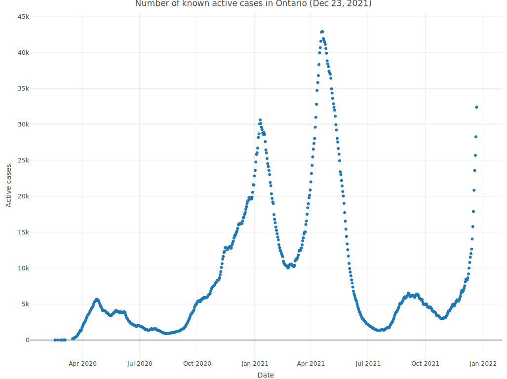
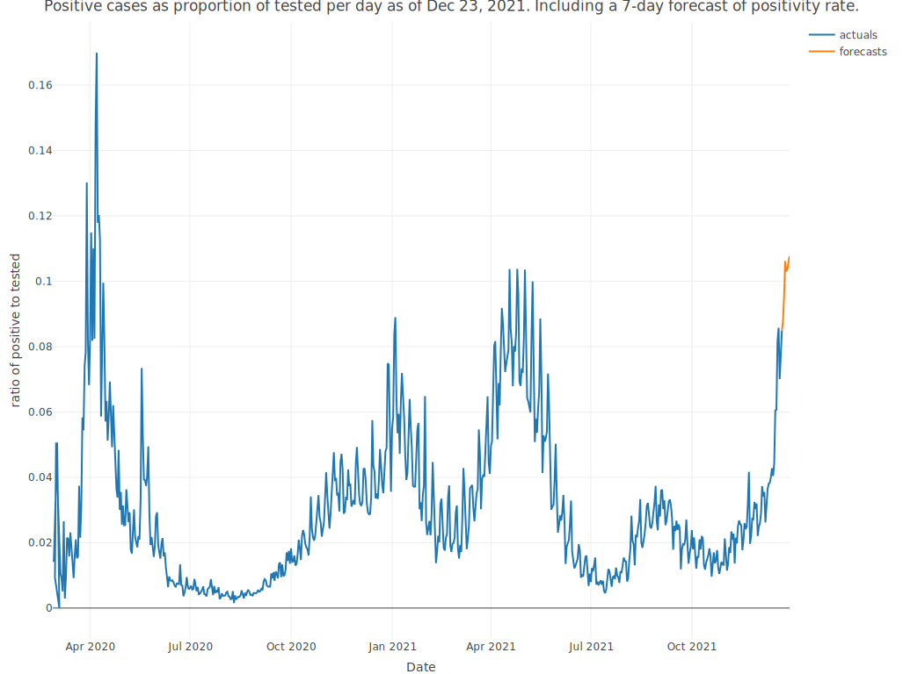
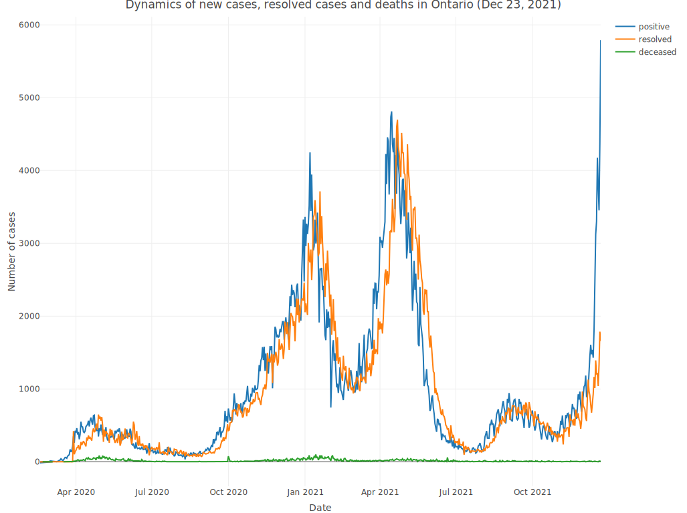

# Ontario data of corona virus cases

The data is collected from the Ontario Ministry of Health's (MOH) website. Updated daily and uploaded to this REPO. For details on the data  see Ontario Ministry of Health's website [https://www.ontario.ca/page/2019-novel-coronavirus](https://www.ontario.ca/page/2019-novel-coronavirus)

# Current cases

The figures below show the number of current active cases as well as the dynamics of those cases – how many new cases have been acquired, how many have been resolved and how many deaths have occurred.

## Active cases in Ontario

## Positive cases as % of tested individuals

## Dynamics of new cases in Ontario

# Updates

##  September 28, 2020
Adding a new plot – the proportion of positive tests by day. The dynamics of cases plot has become meaningless because of the amount of new test conducted every day. Currently, there are around 40,000 cases performed every day. Previously there much less. The raw number of new cases will be much larger, even though the total number of new cases as a proportion of the general population might not have changed. This plot tries to standardize these new case numbers for the amounts of tests performed. 

## April 29, 2019

Ontario Ministry of Health now publishes this data as part of Ontario Open Data Catalog. Link to the Ministry's source is [https://data.ontario.ca/dataset/confirmed-positive-cases-of-covid-19-in-ontario](https://data.ontario.ca/dataset/confirmed-positive-cases-of-covid-19-in-ontario). 
I have updated my dataset with the missing data before Feb 18, 2020  and plugged in some holes since Feb 18.

## April 13, 2020

Adding a daily forecast plot for Ontario based on best fit logistics function. Historical fits are in the forecast_plots folder. To view the dynamic HTML file you must download it to your computer then open it with your favorite browser.

## March 30, 2020

Ministry of Health has updated the source data they use to report cases. As a result, there was a slight revision to the numbers reported for March 29, 2020. The biggest change is to the number of positive case (going up from 1,324 to 1,706), cases resolved (going up from 8 to 431) as well as the number of cases under investigation (going down from 7,203 to 5,651). There was also a slight revision to the number of test conducted (revised downward by about 1,000 cases) and number of negative cases (going up by 20). 

# Time period

Data collection started Feb 18, 2020 (with some gaps) until present day.

# Data details

## daily_ts.csv

Data of cases tested and the number of confirmed positive and negative results. *Pull_date* is when the data was collected. *Pull_time* is the date plus time when the data was pulled. *Update_date* is the date reported on the MOH's website. 

# Archived data

Ministry of Health has stopped publishing details of each case on their website. As a result I am moving this data to archives as it would not updated any longer. Archived data can be found in the archived folder. See update note for March 30, 2020 for more details.

## cases_ts.csv

Time series data of cased details by day. There is a lot of missing data especially for more recent cases. Unfortunately, as far as I know, the Ministry does not publish updates to the data so I cannot update the case details. 
